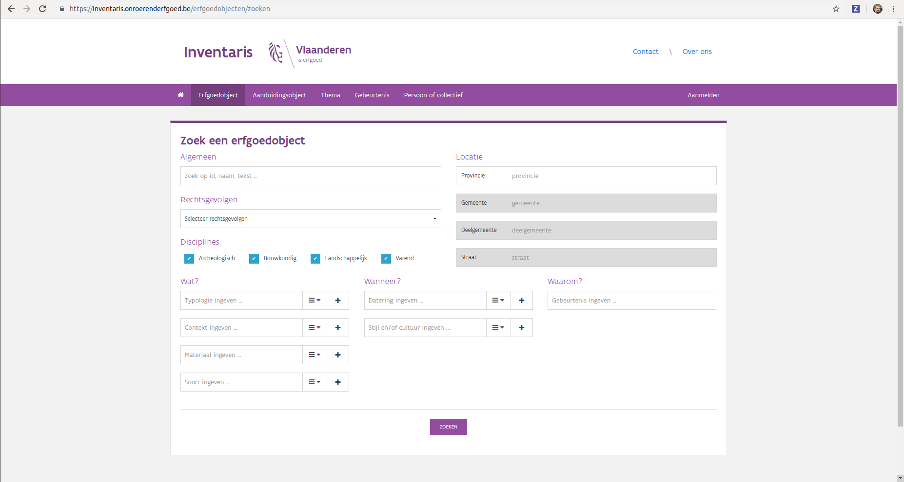
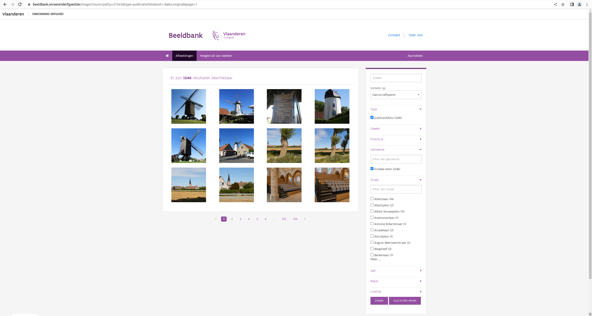
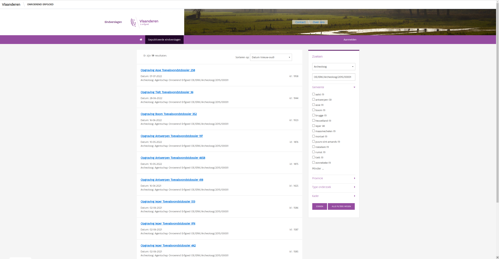

# Zoekformulieren

Elke gebruiker die informatie zoekt in een Onroerend Erfgoed toepassing, start
bij een zoekformulier. Een pagina waar je kan kenbaar maken wat je zoekt door
één of meer criteria of zoekparameters op te geven. Hoe beter je snapt wat zo'n
formulier wel en niet kan betekenen voor je, hoe gerichter je zult kunnen
zoeken. Een ideale start voor onze verkenningstocht in informatieland!

In onze toepassingen maken we gebruik van twee grote types zoekformulieren.
Beide types zijn niet uniek voor onroerend erfgoed en zal je op andere plaatsen
op het internet ook tegenkomen. Het
eerste type, **het standaard zoekformulier** is het typische zoekformulier
zoals gekend in de [inventaris onroerend
erfgoed](https://inventaris.onroerenderfgoed.be). Het tweede type, **facetted
search** wordt gebruikt in de [beeldbank](https://beeldbank.onroerenderfgoed.be) of 
de gepubliceerde eindverslagen van het archeologieportaal. De keuze voor het
ene of het andere type wordt gemaakt in functie van de dataset die moet
doorzocht worden en de doelgroep waarop het formulier mikt.

Omdat de achterliggende principes bij beide zoekformulieren sterk gelijkend
zijn, behandelen we eerst het standaard zoekformulier. Daarna kijken we naar de
facetted search, met aandacht voor de aspecten waarop het afwijkt van het
standaard zoekformulier.

```{note}

Bij het bespreken van de zoekformulieren maken we steeds gebruik van dezelfde
voorbeelden. Voor het standaard zoekformulier maken we gebruik van de
[erfgoedobjecten](https://inventaris.onroerenderfgoed.be/erfgoedobjecten/zoeken) 
uit de inventaris onroerend erfgoed. Wanneer we het over een facetted search
zoekformulier hebben, dan gebruiken we dat van de
[beeldbank](https://beeldbank.onroerenderfgoed.be/images). Voor specifieke
informatie over andere zoekformulieren kan je terecht in [](toepassingen.md).
```

## Het standaard zoekformulier



*Het [zoekformulier voor
erfgoedobjecten](https://inventaris.onroerenderfgoed.be/erfgoedobjecten/zoeken) in de inventaris onroerend erfgoed*

Wanneer we een zoekformulier gebruiken, combineren we zoekparameters om een volledige
dataset te herleiden tot enkel die gegevens die we nodig hebben. Elke
zoekparameter is een criterium waaraan de gewenste gegevens moeten
beantwoorden. We willen bijvoorbeeld enkel gegevens uit de provincie Antwerpen
zien of enkel het bouwkundig erfgoed. In een zoekformulier doen we dit door een
zoekveld te gebruiken. Om bijvoorbeeld enkel informatie uit de provincie Antwerpen
te zien, vullen we in het zoekveld *Provincie* de waarde *Antwerpen* in. Onze zoekvelden
trachten we zo intelligent mogelijk door maximaal duidelijk te maken wat er van je verwacht wordt
en ervoor te zorgen dat je geen zinloze vragen kunt stellen. Het heeft geen zin
een gebruiker te laten zoeken op *Brabant* als we al weten dat enkel
*Vlaams-Brabant* tot resultaten zal leiden. Bij de 
zoekvelden bestaan er een paar verschillende types:

- **Vrije invoer**: Je kunt invullen wat je wil. Meestal gaat het om een stukje
    tekst of een getal. Er is geen garantie dat wat je zoekt ook echt bestaat
    in de dataset.
- **Gevalideerde invoer**: Je invoer wordt gevalideerd volgens één of meer
    validatieregels, bv. in een zoeveld op stamomtrek moet de ingevoerd waarde
    een getal zijn. Het zoekveld verhindert dus dat je ongeldige waarden
    invult. Er is geen garantie dat wat je zoekt ook echt bestaat in de
    dataset.
- **Datum**: Je kunt enkel een geldige datum invullen. Dit is een specifieke
    vorm van gevalideerde invoer. Het zoekveld helpt je zodat je geen ongeldige 
    datums kunt invullen (30 februari) en ook geen fout of onduidelijk datumformaat
    kunt gebruiken (in de VS is 04/06 6 april in plaats van 4 juni). Er is geen 
    garantie dat de datum die je zoekt ook echt bestaat in de dataset.
- **Ja/Nee**: Je kunt enkel het veld aankruisen (Ja) of leeg laten (Nee). Dit
    soort zoekveld helpt je met simpele zoekparameters waar we gewoon willen
    weten of iets aan- of afwezig is. Normaal zal je zowel met Ja als met Nee
    resultaten krijgen.
- **Keuzelijst**: Je kunt enkel invullen wat in een lijst van geldige en
    zinvolle waarden voorkomt. Normaal zal elke waarde in de lijst resulaten
    opleveren.
- **Thesaurus**: Je kunt enkel invullen wat in een lijst van geldige en
    zinvolle waarden voorkomt. Dit is een specifiekere vorm van keuzelijst waar
    een complexe thesaurus met eigen regels en logica achterzit die je in staat
    stelt snel en makkelijk geavanceerde vragen te stellen. [Verder](onderwerpen.md) 
    in deze handleiding gaan we hier dieper op in.

Wanneer je een zoekformulier gebruikt, vul je een waarde in in het juiste
zoekveld en klik je op zoeken. Daarna krijg je een lijst met alle
resultaten die beantwoorden aan je vraag, bv. alle erfgoedobjecten in de
provincie *West-Vlaanderen*. Omdat zo'n lijst met zoekresultaten erg lang kan zijn en
je als gebruiker niet te lang wil wachten op alle zoekresultaten, worden deze
gepagineerd weergegeven. Je krijgt dus de eerste 10 of 20 resultaten te
zien en kunt verder bladeren naar de volgende pagina met resultaten.

Bij de meeste zoekformulieren in het mogelijk te kiezen in welke **sorteervolgorde** de
resultaten aan je gepresenteerd worden. Er is steeds een standaardvolgorde
voorzien, maar vaak is het nuttig om deze aan te passen. Typische kenmerken
waarop je kan sorteren zijn het *id* (een uniek nummer per resultaat) of een
*naam* of *titel* (een korte beschrijving van het resultaat). Soms zijn er
complexere zaken mogelijk. Bij de inventaris is het bijvoorbeeld mogelijk om te
sorteren op *locatie* zodat je zoekresultaten gegroepeerd zijn per gemeente en
per straat. Bij het sorteren is het meestal mogelijk om zowel in oplopende als
aflopende volgorde te sorteren. Je kan dus de titels sorteren van A naar Z of
van Z naar A.

Als je de erfgoedobjecten in West-Vlaanderen gezocht hebt, krijg je natuurlijk
een zeer lange lijst. Je kan die dan wel sorteren en gepagineerd doorbladeren,
vaak zal je toch een iets specifiekere set van gegevens willen bekijken. Dat
kan je doen, door zoekparameters te **combineren**. Op het zoekformulier kan je
namelijk zoveel velden invullen als je maar wil. Je kan bijvoorbeeld aangeven
dat je op zoek bent naar erfgoedobjecten in West-Vlaanderen die een mate van 
bescherming genieten door in de keuzelijst van het veld *rechtsgevolg* te kiezen 
voor *beschermd* en de *provincie* in te stellen op *West-Vlaanderen*. Indien
je meerdere velden invult in het zoekformulier, zeg je dus altijd dat je enkel
de gegevens zoekt die beantwoorden aan de beide criteria. Je zoekt naar
*rechtsgevolgen=beschermd erfgoed* **EN** *provincie=West-Vlaanderen*. Je kan
blijven zoekparameters toevoegen.

Hou er wel rekening mee dat hoe meer voorwaarden je stelt, hoe groter de kans 
is dat je zonder resultaten eindigt. Ook hier tracht het zoekformulier je wat
te gidsen. Het is bijvoorbeeld niet mogelijk te zoeken naar erfgoedobjecten die
gelegen zijn in de provincie Antwerpen EN de gemeente Knokke-Heist. Het
zoekveld gemeente is namelijk afhankelijk van de waarde die ingevuld is bij
provincie. Indien je voor de provincie Anwerpen kiest, zal je ook enkel nog de
gemeentes uit Antwerpen kunnen selecteren. En daaruit volgt ook weer dat je, na
de keuze voor een gemeente, enkel nog de deelgemeenten en straten in die
gemeente kunt kiezen. Er zijn echter grenzen aan wat een zoekformulier kan
tegenhouden. Indien je zoekt naar *discipline=archeologisch* **EN** *typologie=knotbomen* 
**EN** *stijl=art deco*, dan zal je niet veel vinden omdat er nu eenmaal geen 
knotbomen in art deco stijl zijn die archeolgisch onderzocht werden. Als je dus
geen zoekresultaten krijgt wanneer je veel criteria hebt ingesteld, is het
altijd nuttig om eens wat minder criteria in te stellen en na te gaan of de
vraag die je stelt wel zinnig is.

```{important}

Indien je op een zoekformulier meerdere parameters invult, dan worden deze
altijd met **EN** gecombineerd.
```

Omdat de meeste zoekformulieren gericht zijn op een groot publiek, trachten we
die simpel en intuïtief te houden. Het is dan ook voor de meeste zoekvelden
niet mogelijk om meerdere waarden in te geven. Je kan slechts één provincie
kiezen, slechts 1 gemeente of deelgemeente. Voor een beperkt aantal velden is
dat echter wel mogelijk. Bij het zoekformulier op erfgoedobjecten zijn dit
hoofdzakelijk de velden van het type thesaurus. Zo kan je op meerdere waarden
zoeken bij *typologie*, *soort* of *stijl*. Wanneer je dit doet, dan worden
deze gecombineerd met **OF**. Indien je dus bij *stijl* zowel *art deco* als
*art nouveau* selecteert dan vraag je alle erfgoedobjecten waarbij
*stijl=art deco* **OF** *stijl=art nouveau*. Dit is voor de doorsnee gebruiker 
meestal de gewenste uitkomst. Zoeken naar erfgoed van 1 of meerdere stijlen of
types is vaker gewenst dan zoeken naar erfgoed dat aan al die stijlen voldoet.

```{important}

Indien je op een zoekformulier binnen een bepaalde parameter meerdere waarden
invult, dan worden deze altijd met **OF** gecombineerd.
```

De meeste zoekvelden op een formulier filteren de gegevens. Alles wat
beantwoord aan de zoekparameter wordt getoond, alles wat niet beantwoord aan de
parameter wordt niet getoond. Het is alles of niets. De meeste formulieren
hebben echter ook een full-text zoekveld dat net iets anders werkt. Bij de
erfgoedobjecten is dit het zoekveld *algemeen*, maar de naam kan verschillen
van toepassing tot toepassing. Bij een dergeljk zoekveld geef je één of meer
woorden op die zullen gezocht worden in de databank. Indien een bepaald woord
voorkomt bij een bepaalde fiche of object, dan wordt de fiche getoond, anders
niet. Echter, de toepassing zal niet enkel de fiches met dit woord behouden,
maar zal fiches waarin dit woord belangrijker is, bovenaan de lijst met
resultaten zetten. Indien je bijvoorbeeld zoekt op *[algemeen=gravensteen](https://inventaris.onroerenderfgoed.be/erfgoedobjecten?tekst=gravensteen)*, dan
zie je dat het Gravensteen te Gent bovenaan de lijst met zoekresultaten staat.
Wannneer je kijkt naar de sorteervolgorde, dan zie je dat deze op *Relevantie*
staat, in plaats van het normale *Locatie*. Deze sorteervolgorde bestaat enkel
indien je iets hebt ingevuld in het full-text zoekveld. Ze zorgt ervoor dat je
resultaten gesorteerd worden van meest relevant (het Gravensteen te Gent) naar 
minst relevant (een fiche over de stadskern van Aalst waarin het woord
Gravensteen voorkomt). Je kan er
altijd voor kiezen om dit niet te doen, door manueel de sorteervolgorde aan te
passen naar *Locatie*. Full-text zoeken is een relatief complex onderwerp, waar
je [verderop](zoeken.md) meer over kan lezen.

```{important}

Indien je full-text zoekt in een zoekformulier, dan wordt de sorteervolgorde
automatisch op *Relevantie* gezet.
```

Als je dit alles combineert kan je dus zoeken naar erfgoed in *Oost-Vlaanderen*
van het type *woonhuizen* in de stijl *art deco* of *art nouveau* waarin het
woord *marmer* voorkomt. Je kan de
[resultaten](https://inventaris.onroerenderfgoed.be/erfgoedobjecten?tekst=marmer&provincie=40000&typologie=https%3A%2F%2Fid.erfgoed.net%2Fthesauri%2Ferfgoedtypes%2F522&stijl=[https%3A%2F%2Fid.erfgoed.net%2Fthesauri%2Fstijlen_en_culturen%2F22,https%3A%2F%2Fid.erfgoed.net%2Fthesauri%2Fstijlen_en_culturen%2F30]) 
sorteren op relevantie, naam of op locatie. Je kan de resultaten doorbladeren en 
zo alles bekijken wat de toepassing gevonden heeft voor je.

## Facetted Search. Een alternatief zoekformulier.



*Het [zoekformulier voor
afbeeldingen](https://beeldbank.onroerenderfgoed.be/images) in de beeldbank onroerend erfgoed*

Binnen de inventaris onroerend erfgoed is het standaard zoekformulier
alomtegenwoordig. Daarbuiten gebruiken we vaak een alternatief, de facetted
search. Voornaamste verschil is dat je bij een dergelijk zoekformulier eerder
iteratief te werk gaat. Bij het standaard zoekformulier zijn het zoekformulier
en de resultatenlijst aparte webpagina's. Bij facetted search zijn deze
samengevoegd en kies je steeds extra filters totdat je de resultaten hebt die
je zoekt. Deze manier van zoeken is zeker niet uniek voor Onroerend Erfgoed en
wordt ook vaak gebruikt op andere website, zoals webwinkels.

Bij Facetted Search heb je ook weer de mogelijkheid om met meerdere zoekvelden 
te werken, full-text te zoeken, resultaten te sorteren en door de pagina's met 
resultaten te bladeren. Net als bij het standaard zoekformulier. Ook hier tellen
de basisregels: indien je twee zoekvelden combineert, dan gaat het om een EN 
combinatie, indien je twee waarden binnen een zoekveld combineert, dan gaat het 
om een OF combinatie. Je kunt dus zoeken in de Beeldbank naar
[afbeeldingen uit *Knokke-Heist* OF *Brugge* EN genomen in *2004* of *2006*](https://beeldbank.onroerenderfgoed.be/images?text=&sort=-dates.original&searchFilter=&municipality=31005&municipality=31043&year=2006&year=2004).



*Het [zoeformulier voor eindverslagen archeologie](https://loket.onroerenderfgoed.be/archeologie/rapporten/eindverslagen) waarbij naar een archeoloog gezocht wordt op naam en de gemeente kan gekozen worden via een facet.*

Facetted search toepassen op een veld waarvan je weet dat elke waarde uniek is of 
slechts héél weinig voorkomt is onhandig. Dat leidt tot ellenlange uitklaplijsten 
waarin je verplicht moet gaan zoeken naar die ene waarde die jou interesseer. Net 
hetzelfde probleem stelt zich bij een zoekveld waarin héél veel verschillende waarden 
voorkomen. Hiervoor hebben we een aantal oplossing. Soms lossen we dit op door voor 
een zoekparameter een klassiek veld te voorzien in plaats van de typische uitklaplijst 
die bij een facet hoort. Zo kan je bij de [eindverslagen archeologie](https://loket.onroerenderfgoed.be/archeologie/rapporten/eindverslagen)
zoeken naar een verslag met een specifiek ID of Projectcode via een klassiek veld
waarin je vrij bent in te voeren wat je wenst. Voor deze velden is er geen andere
zinvolle oplossing aangezien het ID uniek is en de Projectcode dat ook meestal is.

*Filteren van het gemeentefacet op de beeldbank*

Een andere techniek die we toepassen is het voorzien van een extra veld waarin je
de lijst van waarden binnen één facet snel kunt doorzoeken. Dit passen we regelmatig 
toe op een gemeente filter. Dit facet kan soms maar een heel klein aantal unieke 
waarden bevatten, maar soms moeten er 300 gemeenten getoond worden. In dat geval
is het niet evident om die ene gemeente die je zoekt te vinden in de uitklaplijst.
Daarom voorzien we een tektsveld waarmee je de lijst weer snel kunt doorzoeken.

Of we een standaard zoekformulier bouwen of een facetted search hangt af van een 
aantal factoren. In de eerste plaats, de dataset die we doorzoekbaar willen maken 
en de benodigde zoekparameters. Facetted search werkt goed voor de datasets waar 
we een relatief beperkt aantal filters hebben en waarbij elke filter een beperkt 
aantal mogelijke waarden heeft. Verwerken van een zoekveld dat aangestuurd wordt 
door een thesaurus of andere complexere logica is moeilijk. Daarnaast speelt de 
doelgroep waarop we mikken ook een rol. De doorsnee gebruiker lijkt een facetted
search te verkiezen omdat het intuïtieve aanvoelt. Het standaard zoekformulier 
heeft dan echter weer mogelijkheden voor complexere zoekfilters die een facetted
niet heeft. Het blijft dus steeds een afweging van voor- en nadelen van beide 
systemen om tot een optimale keuze te komen. Niets sluit uit dat we in de toekomst 
voor bepaalde datasets andere keuzes maken of dat er nieuwe types zoekformulieren 
ontstaan.
