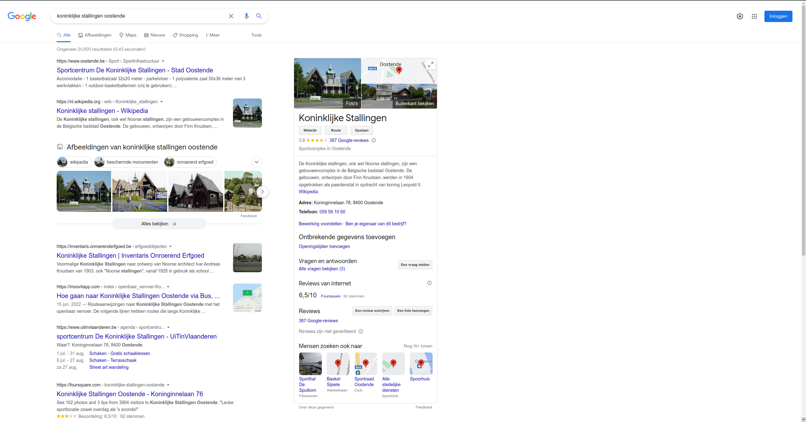

# Inleiding


Deze handleiding tracht een houvast te bieden aan iedereen die gebruik maakt
van de informatiesystemen van het [agentschap Onroerend
Erfgoed](https://www.onroerenderfgoed.be) en vooral zij die daarin op zoek
gaan naar specifieke informatie of gegevens. De gemiddelde gebruiker vindt
hopelijk snel en intuïtief zijn weg naar zijn of haar favoriete monument of
naar archeologienota's in hun gemeente. Deze handleiding geeft extra
handvaten aan de iets meer gevorderde gebruiker om complexere vragen te kunnen
beantwoorden zoals *Hoeveel gothische parochiekerken zijn er in
Oost-Vlaanderen?*, *Ik wil meer weten over de Lieve* of *Ik wil alle eindverslagen 
archeologisch onderzoek van het type opgraving in Limburg zien*.

Binnen Onroerend Erfgoed trachten we met patronen te werken. Steeds
terugkomende uitdagingen, gaan we op een gelijkaardige manier aanpakken. We vinden 
dus niet voor elke nieuwe toepassing het warm water opnieuw uit. Dit is een algemeen 
principe dat voor veel zaken telt, maar zeker voor zoeken.
Veel dan de zoekopties die we aanbieden, bieden we in elk toepassing aan. We 
starten dan ook met een [algemene uiteenzetting](formulieren.md) over onze
zoekformulieren waarin we uitleggen hoe de gemiddelde zoekformulieren werken.

Eens we het basis zoekformulier onder de knie hebben, nemen we het [full-text
zoeken](zoeken.md) onder de loupe. Dat is een heel krachtige manier van zoeken
waarbij je op basis van één enkel tekstveld, krachtige zoekacties (of qeuries)
kan uitvoeren.

In een volgende hoofdstuk gaan we dieper in op een aantal [inhoudelijke
onderwerpen](onderwerpen.md) die in meerdere toepassingen terugkomen. Een beter
begrip over hoe we omgaan met zaken zoals adresdata of thesauri kan heel erg
helpen de informatie die je zoekt terug te vinden.

De iets technischer gebruiker die nog op zijn honger zit, wordt daarna op zijn
wenken bediend en krijgt een inzicht in een aantal [geavanceerde
opties](geavanceerd.md).

Tenslotte eindigen we met een hoofdstuk waarin we niet meer in algemeenheden
spreken, maar dieper ingaan op de verschillende [toepassingen](toepassingen.md) 
die we hebben en een aantal specifieke zoekopties per toepassing toelichten.

## Alternatieven

Voor we een diepe duik nemen in het zoeken en hopelijk vinden van gegevens in
de informatiesystemen van het agentschap, willen we nog even benadrukken dat
er nog alternatieven zijn die niet aan bod komen in deze handleiding.


*Onroerend erfgoed in het Westerkwartier te Oostende op het Geoportaal*

```{index} geoportaal
```

**Het Geoportaal** Indien je voornamelijk op zoek bent naar erfgoed op een
specifieke, geografische locatie, dan is het
[Geoportaal](https://geo.onroerenderfgoed.be) je beste keus. Deze toepassing,
die zowel op je laptop, je tablet als je smartphone werkt, stelt je in staat om
snel te zien welk erfgoed er kan aangetroffen worden op een bepaalde plaats. Er
zijn tools en knoppen om snel te zoomen naar een adres of perceel of je kan
naar hartelust op de kaart zoomen, pannen en klikken. Het geoportaal bevat een
weelde aan informatielagen over onroerend erfgoed en kan ook gecombineerd
worden met historische kaarten (Ferraris, Popp, ...) of informatielagen van
andere Vlaamse overheden. Kortom, een ware schatkist aan geografische informatie 
voor wie voornamelijk wil weten wat waar ligt.



*Bij een zoekactie via Google naar de Koninlijke Stallingen te Oostende, staat
de desbetreffende fiche op de inventaris hoog in de lijst*

**Zoekmachines** Indien je snel op zoek bent naar informatie over een bepaald
gebouw, dan is een goeie zoekmachine zoals Google of Bing nog altijd een
goede keuze. We besteden heel veel aandacht aan *SEO*, het optimaliseren van onze
databanken en websites voor zoekmachines. Je zult ongetwijfeld al gemerkt
hebben dat als je de naam van een beschermd monument of landschap intikt in een
zoekmachine, er vaak resultaten van de inventaris onroerend erfgoed op de
eerste pagina staan. Of als je zoekt naar *archeologienota* en de naam van een 
gemeente, je meteen een waslijst aan archeologienota's te zien krijgt. Ook dit
zijn zeer geldige en zinvolle technieken om op de pagina's en fiches te landen
die jou boeien!
