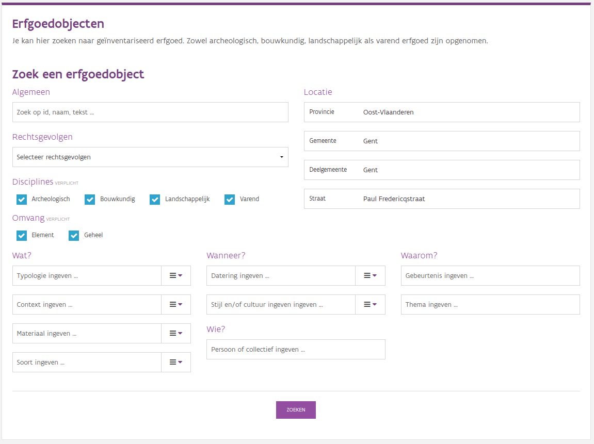
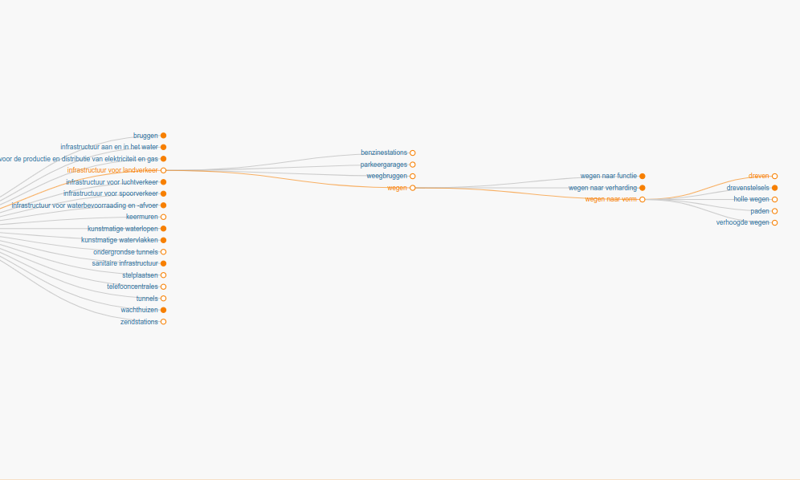

# Het Onroerend Erfgoed datadomein

De toepassingen die we bouwen hebben één voorname gemeenschappelijke delen, 
ons onroerend erfgoed. Ze hebben allemaal betrekking op onroerend erfgoed, 
resten van het verleden die ergens in Vlaanderen aangetroffen worden en die 
willen beschrijven, bewaren en beheren. Het spreekt dan ook voor zich dat er
bepaalde aspecten zijn die vaak terugkomen. Bijna al onze toepassingen 
hebben te maken met de één of de andere vorm van locatie gebonden informatie.
En vaak maken we gebruik van een thesaurus om gegevens te beschrijven. We 
staan dan ook graag even stil bij een aantal onderwerpen die relevant zijn 
als je vaak op zoek gaat naar informatie in onze systemen.

## Locatiedata

Onroerend erfgoed is, zoals het woord het zelf zegt, van nature gebonden 
aan een locatie. Dit kan gaan van kleine locaties zoals één enkele boom of
een kapel, over iets grotere zaken zoals een huis, villa of hoeve en 
bouwkundige gehelen zoals kasteeldomeinen en begijnhoven tot zéér grote 
landschappen. Allemaal zijn ze aan de grond gebonden, alleen de oppervlakte
die ze beslaan verschilt.

Er zijn twee manieren om deze gebondenheid aan de grond te benaderen. Ofwel 
gebruik je **GIS-technologie** om de locatie van een object nauwkeurig af te 
bakenen en te doorzoeken. Ofwel beschrijf je de locatie van een object met 
**namen en woorden**. 

Met GIS-technologie kan je zeer nauwkeurig zijn, maar het is een complexere
manier om met informatie om te gaan. Het vereist dat je opslaat op welke 
punten op het aardoppervlak een bepaald object gelegen is. Dit kan een computer
voor je visualiseren op een kaart. Maar de ruwe data, die punten zelf, zijn
nietszeggend voor een mens. Het is dus voor een mens ook geen intuïtieve manier
om een zoekformulier aan te sturen. We laten wel toe dat onze data puur 
geografisch doorzocht worden, maar dat vraagt een afzonderlijke User Interface.
Die bieden we bijvoorbeeld aan op het [Geoportaal](https://geo.onroerenderfgoed.be)
waar je als gebruiker kunt klikken op een kaart om een zoekactie te starten.

Locaties beschrijven met namen en woorden is iets wat mensen al millenia doen.
Mensen geven continu namen aan dingen. Onroerend Erfgoed is bevoegd voor het 
onroend erfgoed in Vlaanderen, dat deel uitmaakt van België en Europa. De hoofdzetel
is gevestigd in de stad Brussel, in het Vlaams Administratief Centrum 
Herman Teirlinck op het adres Havenlaan 88 bus 5. Allemaal namen die iets 
zeggen over een geografische locatie, van een zeer nauwkeurige plaatsbepaling 
(een adres) tot een aanduiding van een continent. We kunnen dus als mensen vrij 
goed communiceren over locaties op een manier die wij makkelijk begrijpen 
en toch niet al te veel van onze hersenen vraagt.



*Zoeken naar erfgoedobjecten in de Paul Fredericqstraat te Gent*

In onze toepassingen kan je courant de volgende types van plaatsaanduidingen
aantreffen:

**Provincie** Er kan meestal gezocht worden op de vijf Vlaamse provincies.
Dit is een makkelijke manier om een grote set van zoekresultaten te beperken
tot een behapbaar geografische gebied.

```{index} gemeente
```

**Gemeente** Bijna overal kan er op gemeente gezocht worden. Een zeer
courante eenheid die voor veel mensen de eerste geografische filter is 
die ze activeren. De lijst met gemeente in Vlaanderen wordt officieel 
vastgelegd en kan enkel wijzigen als gevolg van fusies. In geval van een
fusie worden alle databanken van Onroerend Erfgoed aangepast zodat enkel
nog de nieuwe gemeenten gebruikt worden. Alle gegevens worden toegekend
aan de nieuwe geldende grenzen.

```{index} deelgemeente
```

**Deelgemeente** Kan doorzocht worden in een aantal toepassingen, in de 
eerste plaats de 
[Inventaris Onroerend Erfgoed](https://inventaris.onroerenderfgoed.be).
Er bestaat geen officiële lijst van deelgemeenten die geldt voor gans 
Vlaanderen. Daarom heeft het agentschap een eigen lijst gemaakt met
wat wij als deelgemeente beschouwen. Deze heeft buiten Onroerend Erfgoed
geen toepassing en komt niet exact overeen met de postkantons, kadastrale 
afdelingen, statistische sectoren of andere indelingen die elders 
gebruikt worden. Ze moetvooral gezien worden als een lijst van historische 
kernen die vandaag nog betekenisvol genoeg zijn en als context dienen 
bij het ontstaan van onroerend erfgoed. Deelgemeenten hebben vandaag 
geen invloed meer op correcte adressen (elk adres in Vlaanderen moet 
uniek zijn in de volledige gemeente), maar ze helpen wel grip krijgen op
het grondgebied van een gemeente, zekere de grotere landelijke gemeenten
met veel heterogene kernen. Gelet op de huidige fusiegolven blijft het 
gegeven dus interessant.

```{note}

De lijst van deelgemeenten zoals ze gebruikt wordt door Onroerend Erfgoed
wordt ter beschikking gesteld aan derden als open data 
{cite:p}`van_daele_deelgemeenten_2021` onder een [Creative Commons Attribution 
4.0 International](https://creativecommons.org/licenses/by/4.0/) licentie. 
Iedereen kan deze lijst downloaden en in zijn eigen informatiesystemen 
of databanken integreren (mits naamsvermelding). De lijst wordt actief 
onderhouden en bij elke gemeentefusie aangepast.
```

```{index} straat
```

**Straat** Kan doorzocht worden in veel toepassingen. Dit is een 
gecontroleerde lijst die wordt aangereikt door 
[Digitaal Vlaanderen](https://www.vlaanderen.be/digitaal-vlaanderen), via 
de webservices van het *CRAB* of het *Adressenregister*. Deze authentieke bron
wordt beheerd door de lokale besturen. Werken met een centrale lijst 
zorgt voor betere afstemming tussen informatiesystemen. Anders schrijft 
de ene over het *Sint-Jacobsplein* terwijl de andere het over het 
*St.-Jakobplein* heeft. Voor je het weet eindig je met gegevens die
niet meer compatibel zijn. Een probleem dat nog héél vaak opduikt wanneer
we adressen in oudere geschreven bronnen bekijken. Ook kleine databanken
of Excel-lijsten die geen gebruik maken van officiële straatnamen zorgen
vaak voor problemen wanneer we die trachten samen te voegen met andere
databronnen. Je kan er dus zeker van zijn dat we in onze zoekformulieren
steeds de officiële lijst met straatnamen in een gemeente aanbieden. Ook 
hier volgen de straatnamen de fusies. Stel dat twee gemeenten die beiden
een Kerkstraat hebben fusioneren, dan zal er in de fusiegemeente na de fusie
exact één Kerkstraat overblijven. De andere straat krijgt een nieuwe naam, 
die wij meteen toepassen in onze systemen. Indien je dus een object zoekt
in zo'n straat die hernoemd werd, dan zoek je die onder de nieuwe naam. Vaak
blijft er echter wel een spoor achter van een oude benaming in een
beschrijvingsveld en kan je die naam nog vinden met full-text zoeken.

```{warning}

Er is geen koppeling tussen de straten en de deelgemeenten. Aangezien de 
deelgemeenten niet bestaan in het *CRAB* of *Adressenregister*, is het 
onmogelijk te achterhalen in welke deelgemeente een straat ligt. Een straat
kan ook in meerdere deelgemeenten liggen. Het is dan ook niet mogelijk om in
een zoekformulier de lijst met straten te filteren op deelgemeente.
```

**Huisnummer** Wordt meestal getoond, maar is niet rechtstreeks doorzoekbaar.
Huisnummers zijn relatief simpele concepten met verregaande gevolgen. Omdat
het potentieel voor verwarring en gemiste resultaten groot is, zoeken
we meestal op straatnaam en bekijken dan de gevonden resultaten in plaats 
van te zoeken op straat en huisnummer. Het is veel moeilijker om huisnummer
actueel te houden dan straatnamen. Er zijn er veel meer dan de straatnamen 
en ze wijzigen ook sneller. We beschikken meestal wel over een huisnummer
ten tijde van de opmaak van een record, maar dat is niet noodzakelijk het
huidige huisnummer. We mogen ook niet vergeten dat adressen geen unieke 
identificatoren voor gebouwen zijn, maar aanduidingen van woonplaatsen van 
personen of postadressen. Veel onroerend erfgoed zoals een wegkapel, een 
bunker, een dreef of een pomp op een dorpsplain heeft dan ook helemaal 
geen huisnummer. Daarnaast is er ook onroerend erfgoed dat 
zo groot is dat adressen betekenisloos worden. Een ankerplaats of 
stadsgezicht identificeren aan de hand van al zijn deeluitmakende adressen 
is een gigantisch karwei met weinig meerwaarde. Dit schaalprobleem zie je 
ook al met iets complexere bouwkundige gehelen zoals een straatwand, 
een beluik of een samenstel van huizen. Vaak worden deze aangeduid met 
adresreeksen. Zo kan een straatwand aangeduid worden met de huisnummers 
*1-9*, als afkorting voor huisnummers 1, 3, 5, 7 en 9. Als je dan 
zoekt op huisnummer 5, dan is deze niet aanwezig in *1-9*, tenzij je daar 
speciale logica voor inbouwt. In de praktijk zijn er dus meer nadelen dan 
voordelen verbonden aan het tekstueel zoeken op adres en bieden we dit dus
niet aan.


````{note}

**Is het echt helemaal niet mogelijk te zoeken op adres?**

Indien je toch heel erg gericht wil zoeken op adres, dan zijn er toch enkele
mogelijkheden:

```{index} geoportaal, geolocation, geozoekdiensten
```

- Ga naar het [Geoportaal](https://geo.onroerenderfgoed.be) en tik het 
adres in de zoekbalk in. Indien je een geldig adres ingeeft, zal de toepassing
zoomen naar de locatie van het adres. Je ziet meteen wat er op die plaats
ligt en met een muisklik krijg je meer info over de objecten die je er
aantreft. Indien het gaat om een perceel, kan je zelfs een *Perceelrapport* 
downloaden met alle erfgoeddata van die plaats. Makkelijk om bij te houden
of zelf af te drukken.
- Indien je zelf wat programmeerervaring hebt, kan je de bovenstaande handeling
zelf uitvoeren en indien nodig aanpassen. Daarvoor gebruik je de 
[GeoLocation service](https://loc.geopunt.be/Help/V4) 
van Digitaal Vlaanderen om een adres te georefereren en de 
[Geozoekdiensten service](https://geo.onroerenderfgoed.be/zoekdiensten/api_doc) 
van Onroerend Erfgoed om het erfgoed op die locatie op te zoeken. Hoe je 
dit concreet kunt uitvoeren in Python kan je leren via een
[Jupyter Notebook](https://github.com/OnroerendErfgoed/scriptorium/blob/v1.1.0/notebooks/10_heritage_by_address.ipynb)
{cite:p}`van_daele_scriptorium_2022`.
- Tenslotte zou je, terug met enige programmeerervaring, alle erfgoed een 
bepaalde straat kunnen opvragen van de inventaris services en de resultaten 
daarvan in een script kunnen vergelijken met het huisnummer dat je zoekt. We 
zetten je daarvoor op weg via {cite:p}`van_daele_scriptorium_2022`.

````

Je kunt onze locatie-gebonden data dus vaak doorzoeken op provincie, gemeente,
deelgemeente en straat. Niet elke combinatie is even nuttig of zinvol. Als je 
wil zoeken naar iets in *Leuven*, hoef je niet nog eens op te geven dat *Leuven*
in *Vlaams-Brabant* ligt. Het kan natuurlijk ook geen kwaad. Zoeken op *gemeente*,
*deelgemeente* en *straat* tegelijk kan wel verwarrend zijn. Stel dat je zoekt 
naar *gemeente=Knokke-Heist*, *deelgemeente=Ramskapelle* en *straat=Lippenslaan*,
dan zal je niets vinden. Je zoekt dan namelijk naar alles dat zowel in Ramskapelle
als de Lippenslaan ligt, iets wat niet kan. In de praktijk zal je dus ofwel op 
*gemeente* en *deelgemeente* zoeken, ofwel op *gemeente* en *straat*.


```{index} thesaurus
```

## Thesauri

Een thesaurus is een gestructureerde begrippenlijst die gebruikt wordt om
terminologie te standaardiseren. Binnen Onroerend Erfgoed gebruiken we deze -
waar mogelijk - om informatie te indexeren en gericht terug te vinden via
zoekoperaties. De voordelen voor de invoerder en gebruikers van een
informatiesysteem zijn legio, maar in essentie komt het er op neer dat iedereen
weet welke begrippen gebruikt worden, welke de betekenis is van die begrippen
en welke de relaties zijn tussen de begrippen {cite:p}`mortier_calling_2017`.

Op onze [thesaurus website](https://thesaurus.onroerenderfgoed.be) kan je alle
thesauri die Onroerend Erfgoed publiceert raadplegen. Elke thesaurus bestaat
uit een hiërarchische lijst van concepten, elk met hun definitie en één of 
meerdere labels. Indien een concept meerdere labels heeft, dan is er altijd exact 
één label dat de voorkeur geniet voor een bepaalde taal. Thesauri kunnen dus 
meertalig zijn. *Lanen* is ingesteld als een alternatieve naam voor [*dreven*](https://thesaurus.onroerenderfgoed.be/conceptschemes/ERFGOEDTYPES/c/128) 
in het Nederlands.



*De hiërarchie van dreven in de [thesaurus van erfgoedtypes](https://thesaurus.onroerenderfgoed.be/conceptschemes/ERFGOEDTYPES)*

Elk concept heeft relaties met andere concepten. Door die relaties wordt er
in de eerste plaats een hiërarchie gemaakt die aangeeft dat *dreven* een 
soort *wegen* zijn, ingedeeld op basis van *vorm*, die dienen voor *landverkeer* 
en eigenlijk onder *infrastructuur* vallen. Naast de hiërarchische relaties,
zijn er soms ook lossere relaties. Zo kunnen we lezen dat [*abdijen*](https://id.erfgoed.net/thesauri/erfgoedtypes/4)
gerelateerd zijn aan [*abdijhoeven*](https://id.erfgoed.net/thesauri/erfgoedtypes/5). 
Immers, een abdij is geen abdijhoeve, maar heeft er wel vaak één. Stel dat je 
op zoek bent naar extra informatie over abdijen, dan is interessant te weten 
dat er iets zoals abdijhoeven bestaat en zetten we je op weg met meer informatie
daarover.

Er valt nog héél wat te vertellen over thesauri, maar we willen ons nu vooral
toespitsen op hoe je ze tijdens een zoekactie kunt gebruiken. Op een
zoekformulier zien ze er niet meteen heel erg anders uit dan gelijk welk
andere keuzelijst, toch zijn ze veel krachtiger. Je hebt twee manieren om
een concept te selecteren waarmee je wens te zoeken. Je kubt iets intikken 
in het zoekveld. Je zoekterm wordt dan in de thesaurus gezocht en de 
resultaten worden getoond. Indien ik dus *abd* intik, dan zie ik dat ik 
zou kunnen zoeken naar *abdijenkerken*, *abdijhoeven*, *onderdelen van kloosters
en abdijen*, *abdijen* of *abdijdomeinen*. Dit werkt vooral goed als ik
al min of meer weet wat ik zoek. Deze zoekfunctie houdt zelfs rekening met
de alternatieve labels van concepten. Als ik *lanen* intik, dan krijg ik het 
concept *dreven* ook te zien omdat we in onze thesaurus hebben aangegeven dat 
*lanen* een niet-voorkeursnaam zijn voor *dreven*. Indien ik niet meteen 
de benaming ken voor het concept dat ik zoek, dan kan ik de volledige
thesaurus doorbladeren. Daarvoor klik ik op het uiklapicoontje. Dan zie je alle
topconcepten uit de thesaurus, die je met het plus-knopje steeds verder
kunt openklappen. Zo kan je klikken op *gebouwen en structuren*, gevolgd 
door *religieuze gebouwen en complexen* om ook weer bij *abdijen* uit
te komen. Indien je dan op *zoeken* klikt, krijg je alle *abdijen* in de 
inventaris Onroerend Erfgoed te zien. 

Zoeken naar *abddijen* bij de erfgoedobjecten van de inventaris, komt
neer op zoeken naar [alle erfgoedobjecten waaraan het concept *abdijen*
is toegekend](https://inventaris.onroerenderfgoed.be/erfgoedobjecten?typologie=4). 
Simpel, omdat *abdijen* in onze thesaurus boom een blad vormt. Mocht 
de thesaurus een boom zijn, dan zitten de *abijden* op het einde van een tak.
Er zijn geen specifiekere vormen van *abdijen*. Echter, bij de 
[*kerken*](https://id.erfgoed.net/thesauri/erfgoedtypes/1005) het anders. Onder
kerken zitten *katholieke*, *protestantse* en *orthodoxe kerken*. En op hun
kennen die ook weer specifiekere vormen. Zo zijn er bij de *katholieke kerken*
momenteel 9 subtypes, zoals *abdijkerken, *kloosterken*, *kathedralen* 
en *parochiekerken*. Onze thesaurus maakt het mogelijk om zowel op een 
specifiek type zoals *kathedralen* te zoeken, maar ook op een verzamelterm
zoals *katholieke kerken*, *kerken* of zelfs het zeer algemene 
*religieuze gebouwen en complexen*. Telkens je in het zoekformulier zoekt
doormiddel van een thesaurus, zal de thesaurus jouw zoekterm analyseren 
en indien nodig omzetten naar een verzameling van termen. Indien je zoekt
op *kathedralen*, dan zijn er geen specifiekere concepten en zoek je dus
exact op *kathedralen*. Indien je zoekt op *katholieke kerken*, dan zoek je
naar alle erfgoedobjecten waaraan één van die 9 subtypes toegekend is of 
naar de erfgoedobjecten waaraan rechtstreeks de verzamelterm 
*katholieke kerken* toeekend werd. Indien je zoekt op *kerken*, dan zoek
je naar alle erfgoedobjecten waaraan *katholieke kerken*, *orthodoxe kerken* 
, *protestantste kerken* of één van hun subtypes of het algemene *kerken*
toegekend zijn. Dat maakt natuurlijk dat hoe hoger je zoekterm in de 
thesaurusboom staat, hoe meer resultaten je zult vinden. Er zijn weinig 
*kathedralen* in Vlaanderen, maar veel *religieuze gebouwen en complexen*.

Dit maakt van een thesaurus een heel krachtig zoekinstrument. Het is niet
enkel een platte lijst van zoektermen die je helpt gerichte en zinvolle
vragen te stellen, maar de zoektermen hebben ook nog eens inherente relaties 
die maken dat je zoekactie veel intuïtievere resultaten oplevert dan wanneer 
je zonder thesaurus zou werken.
